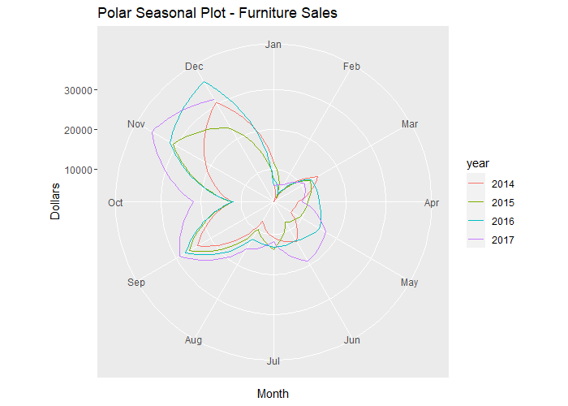

# R_CS_11
TimeSeries Analysis in R

### Case-Study Title: Online retail E-Commerce platform demand prediction (TimeSeries forecasting)
### Data Analysis methodology: CRISP-DM
### Dataset: American Retail company's Sales Timeseries data from 03/01/2014 to 30/12/2017
### Case Goal: Prediction of total monthly revenue in 2017 based-on previous data of the company (sales prediction: cutomers demand prediction) to do annual budget planning

Monthly Total Sales and its Categories line chart

Seasonal plot of Furniture Sales

Polar Seasonal plot of Furniture Sales

Seasonal Subseries plot of Furniture Sales

Auto-correlation plot of Furniture Sales

Partial-Autocorrelation plot of Furniture Sales

Monthly Furniture Sales Trend (Moving-Average 12)

Additive Decomposition of Furniture Sales Timeseries

Multiplicative Decomposition of Furniture Sales Timeseries

STL Decomposition of Furniture Sales Timeseries

Regression Method predictions of next-12 months Furniture Sales

Holt-Winters Method (Exponential Smoothing) prediction residuals of Furniture Sales train data

Holt-Winters Method (Exponential Smoothing) predictions of next-12 months Furniture Sales

ARIMA Method predictions of next-12 months Furniture Sales

